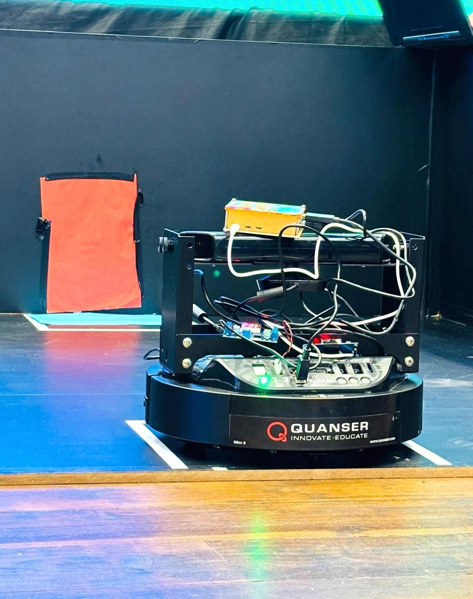
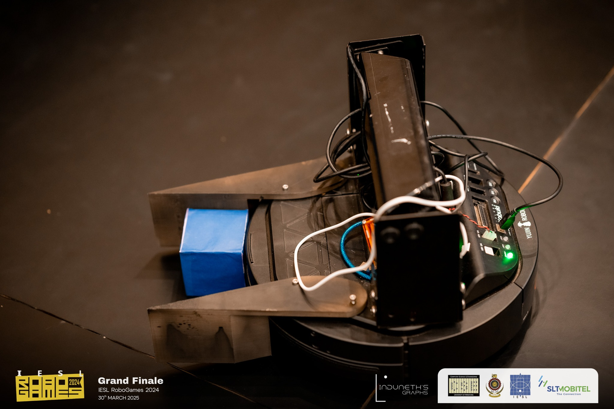
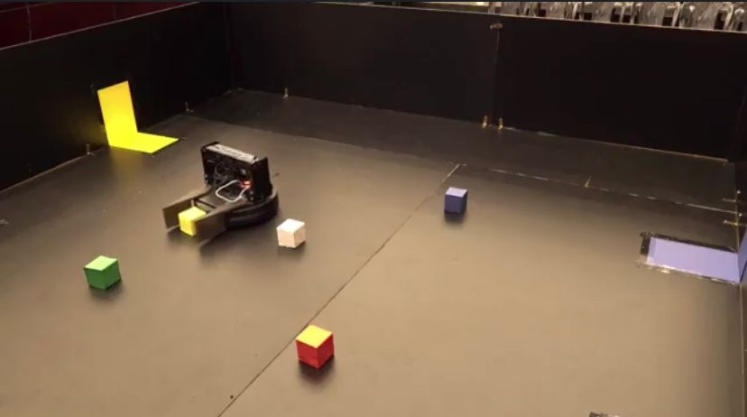
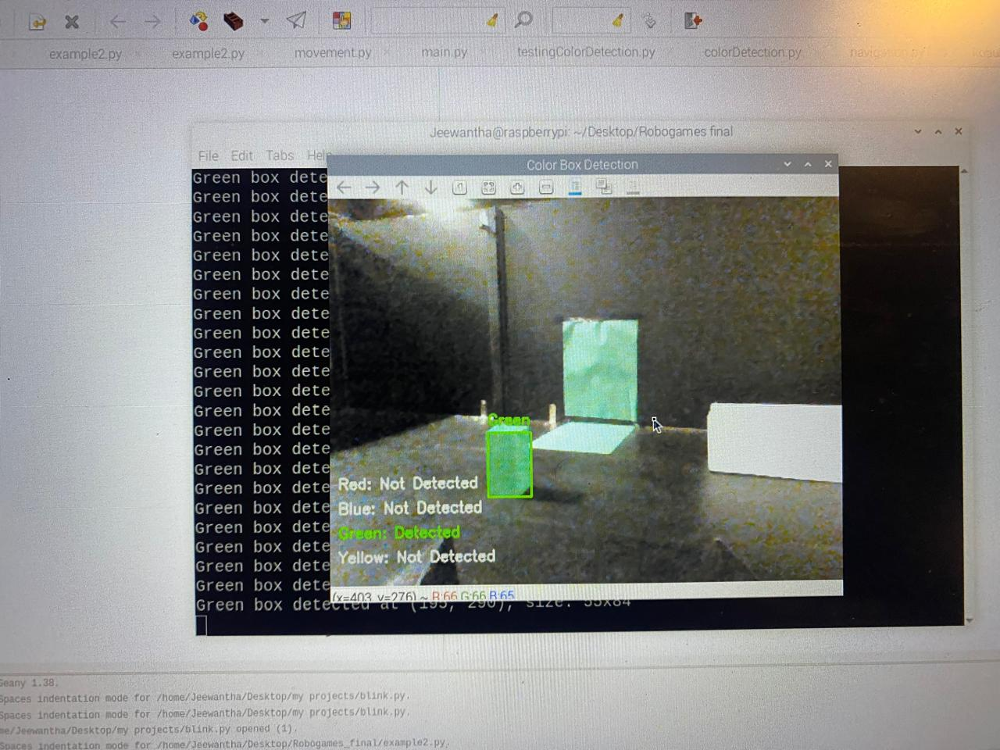

# Vision-Based Navigation of a Kobuki Robot 🤖🧱

This repository contains a fully self-contained, vision-based navigation and manipulation system for the Kobuki robot. The Kobuki base is equipped with a Raspberry Pi 5 and a USB webcam. The goal of the system is to autonomously search for, identify, and deliver four colored cubes (red, green, blue, and yellow) to walls painted in the matching colors, within a bounded arena.

---

## 📋 Table of Contents

1.  [Project Overview](#1-project-overview)
    *   [Key Components & Workflow](#key-components--workflow)
2.  [📁 Folder Structure](#2-folder-structure)
3.  [🛠️ Installation & Dependencies](#3-installation--dependencies)
    *   [3.1. System Requirements](#31-system-requirements)
    *   [3.2. Python Environment & Packages](#32-python-environment--packages)
    *   [3.3. Remote Access (VNC & SSH)](#33-remote-access-vnc--ssh)
    *   
4.  [🚀 Usage Instructions](#4-usage-instructions)
    *   [4.1. Hardware Setup](#41-hardware-setup)
    *   [4.2. Calibrating Color Thresholds](#42-calibrating-color-thresholds)
    *   [4.3. Running the Navigation Program](#43-running-the-navigation-program)
5.  [🧩 Module Descriptions](#5-module-descriptions)
    *   [5.1. `kobukidriversample.py`](#51-kobukidriversamplepy)
    *   [5.2. `colordetectionwhilerotatng.py` & `colordetectionwhilerotatng__.py`](#52-colordetectionwhilerotatngpy--colordetectionwhilerotatng__py)
    *   [5.3. `detectioninmiddle.py`](#53-detectioninmiddlepy)
    *   [5.4. `rotating.py` & `optimizedrotating.py`](#54-rotatingpy--optimizedrotatingpy)
    *   [5.5. `movement.py`](#55-movementpy)
    *   [5.6. `navigation.py`](#56-navigationpy)
    *   [5.7. `main.py`](#57-mainpy)
6.  [💡 Troubleshooting & Tips](#6-troubleshooting--tips)
7.  [📈 Future Improvements](#7-future-improvements)

<p align="center">
  
</p>

---
## 1. Project Overview

This repository contains a fully self-contained, vision-based navigation and manipulation system for the Kobuki robot. The Kobuki base is equipped with a Raspberry Pi 5 and a USB webcam. The goal of the system is to autonomously search for, identify, and deliver four colored cubes (red, green, blue, and yellow) to walls painted in the matching colors, within a bounded arena.

### Key Components & Workflow:

*   **Vision Acquisition:**
    *   A USB webcam captures a forward-facing, 640×480 video stream.
    *   Frames are converted to HSV color space, and simple thresholding plus contour filtering is used to detect colored cubes and walls.
*   **Finite-State Machine (FSM):**
    1.  `SEARCH_COLOR`: Rotate in place until the next target cube enters view.
    2.  `ALIGN_WITH_CUBE`: Center the detected cube’s centroid in the image, adjusting the Kobuki’s heading.
    3.  `APPROACH_CUBE`: Drive forward while maintaining heading until the cube is within “push distance.”
    4.  `DRAG_TO_WALL`: Push the cube forward until the matching-color wall is detected.
    5.  `RELOCATE`: Back away, rotate 180°, and proceed to the next target color.
*   **Motion Control:**
    *   A custom Python driver (`kobukidriversample.py`) interfaces with the Kobuki’s serial port to send linear and angular velocity commands.
    *   All motion is achieved via differential-drive commands (forward velocity, rotation). No ROS dependencies are required.
*   **Logging & Analysis:**
    *   State transitions, detection events, and timestamps are recorded to CSV files for offline review.
    *   Debug modes allow on-screen overlays to visualize masks, contours, and centroids.

By organizing vision, control, and motion logic into separate, well-documented modules, this system remains modular and easy to extend.

---

## 2. 📁 Folder Structure
*   **`config/color_calibration.yaml`**: Contains HSV “lower” and “upper” threshold values for each cube color (red, green, blue, yellow). Edit this file after running calibration scripts so that the vision system detects cubes reliably under your lighting conditions.
*   **`logs/`**: At runtime, a CSV file named like `navigation_log_YYYY-MM-DD_HH-MM-SS.csv` will be created here. It records timestamps, FSM state changes, detection events, and any error messages for post-run analysis.
*   **`samples/test_frames/`**: A handful of static images showing each colored cube on a neutral background. Use these to manually calibrate HSV ranges before running on live camera frames.
*   **`finalCode/*.py`**: Core Python scripts implementing the robot's functionality. See [Module Descriptions](#5-module-descriptions) for details.

---

## 3. 🛠️ Installation & Dependencies

### 3.1. System Requirements

*   **Hardware**
    *   **Kobuki Base** (iRobot/TurtleBot “Kobuki” mobile base)
        *   Differential drive wheels
        *   Onboard battery that supplies 14.8 V nominal
        *   USB port for serial communication with a host computer
    *   **Raspberry Pi 5**
        *   Raspberry Pi OS (64-bit) installed on an SD card (Bullseye or later recommended)
        *   At least 4 GB of RAM recommended for stable OpenCV performance
    *   **Camera**
        *   USB webcam (Logitech C270 or equivalent), capable of at least 640×480 @ 30 fps
    *   **Power**
        *   The Kobuki’s battery → 5 V buck converter → Raspberry Pi 5 (USB-C input)
        *   Ensure the buck converter is rated for at least 3 A @ 5 V (ideally 5A for Pi 5) to power the Pi and camera reliably.

*   **Operating System**
    *   Raspberry Pi OS (64-bit) – Bullseye or newer.
    *   All commands below assume you are logged in as the `pi` user (or equivalent) with `sudo` privileges.

### 3.2. Python Environment & Packages

It's highly recommended to use a Python virtual environment.

1.  **Update & Upgrade System Packages** (run on the Pi):
    ```bash
    sudo apt-get update
    sudo apt-get upgrade -y
    # Consider rebooting if kernel or critical packages were updated
    # sudo reboot
    ```

2.  **Install Python and Pip** (usually pre-installed on Raspberry Pi OS):
    ```bash
    sudo apt-get install python3 python3-pip python3-venv -y
    ```

3.  **Set up a Virtual Environment** (from the project's root directory):
    ```bash
    # Navigate to your project directory
    # cd /path/to/Vision-Based-Navigation-of-a-Kobuki-Robot

    python3 -m venv venv
    source venv/bin/activate
    ```
    *(To deactivate later, simply type `deactivate`)*

4.  **Install Required Python Packages:**
    Create a `requirements.txt` file in the root of your project with the following content:

    ```txt
    opencv-python
    numpy
    pyserial
    PyYAML
    ```

    Then, install them using pip:
    ```bash
    pip install -r requirements.txt
    ```
    Alternatively, install them individually:
    ```bash
    pip install opencv-python numpy pyserial PyYAML
    ```

5.  **Serial Port Permissions (Important for Kobuki):**
    The Kobuki typically connects via `/dev/ttyACM0` or similar. Your user needs permission to access it.
    ```bash
    sudo usermod -a -G dialout $USER
    ```
    You will need to **log out and log back in** (or reboot) for this change to take effect.
    You can check the device name by connecting the Kobuki and running `dmesg | grep tty`.

---

5.  **Serial Port Permissions (Important for Kobuki):**
    The Kobuki typically connects via `/dev/ttyACM0` or similar. Your user needs permission to access it.
    ```bash
    sudo usermod -a -G dialout $USER
    ```
    You will need to **log out and log back in** (or reboot) for this change to take effect.
    You can check the device name by connecting the Kobuki and running `dmesg | grep tty`.

### 3.3. Remote Access (VNC & SSH)

For headless operation and development, remote access to the Raspberry Pi is essential.

*   **SSH (Secure Shell):**
    *   Provides command-line access to the Raspberry Pi.
    *   Essential for running scripts, editing configuration files, updating the system, and general development.
    *   **Enabling SSH on Raspberry Pi OS:**
        *   SSH is often enabled by default on recent Raspberry Pi OS images.
        *   If not, run `sudo raspi-config`.
        *   Navigate to `Interface Options` (or `Interfacing Options`).
        *   Select `SSH` and enable it.
        *   Alternatively, you can enable it via `sudo systemctl enable ssh && sudo systemctl start ssh`.
    *   **Connecting via SSH:**
        *   Find your Raspberry Pi's IP address (e.g., using `hostname -I` on the Pi, or checking your router's connected devices).
        *   From Linux/macOS: `ssh pi@<RASPBERRY_PI_IP_ADDRESS>`
        *   From Windows: Use an SSH client like [PuTTY](https://www.putty.org/).

*   **VNC (Virtual Network Computing):**
    *   Allows you to access the Raspberry Pi's graphical desktop remotely.
    *   Useful for tasks like running GUI-based color calibration tools, viewing OpenCV debug windows, or general desktop interaction without a dedicated monitor.
    *   **Enabling VNC on Raspberry Pi OS:**
        *   Run `sudo raspi-config`.
        *   Navigate to `Interface Options` (or `Interfacing Options`).
        *   Select `VNC` and enable it.
        *   Reboot if prompted. The VNC server (usually RealVNC) should start automatically.
    *   **Connecting via VNC:**
        *   Install a VNC Viewer on your computer (e.g., [RealVNC Viewer](https://www.realvnc.com/en/connect/download/viewer/)).
        *   Connect to the Raspberry Pi's IP address using the VNC Viewer. You'll be prompted for the Pi's username and password.
## 4. 🚀 Usage Instructions

### 4.1. Hardware Setup

1.  **Power:** Ensure the Kobuki battery is charged. Connect the 5V buck converter from the Kobuki's battery output to the Raspberry Pi 5's USB-C power input.
2.  **USB Connections:**
    *   Connect the Kobuki's USB cable to one of the Raspberry Pi's USB ports.
    *   Connect the USB webcam to another USB port on the Raspberry Pi.
3.  **Arena:** Set up your bounded arena with colored walls and place the colored cubes within it. Ensure good, consistent lighting.
<p align="center">
  
</p>

### 4.2. Calibrating Color Thresholds

Accurate color detection is crucial. You'll need to calibrate the HSV (Hue, Saturation, Value) thresholds for each color (red, green, blue, yellow) based on your specific camera, lighting conditions, and cube/wall colors.

1.  **Use Sample Images (Optional but Recommended):**
    The `samples/test_frames/` directory contains static images. You can use a color picker tool (e.g., in GIMP, Photoshop, or an online HSV color picker) to get an initial estimate of the HSV ranges for each color.
    Alternatively, modify one of the detection scripts (e.g., `colordetectionwhilerotatng.py`) to display trackbars for HSV values and run it on these sample images or a live camera feed.
<p align="center">
  
</p>
2.  **Live Calibration:**
    *   It's best to calibrate using the live camera feed in the actual operational environment.
    *   You might need to create a simple calibration script (or adapt an existing detection script) that:
        *   Captures frames from the webcam.
        *   Converts frames to HSV.
        *   Provides trackbars (sliders) to adjust lower and upper HSV bounds for a specific color.
        *   Displays the masked image in real-time to see the effect of your threshold changes.
    *   Aim to isolate only the target color, minimizing noise and false positives.

3.  **Update `config/color_calibration.yaml`:**
    Once you've determined the optimal HSV ranges, open `config/color_calibration.yaml` and update the `lower` and `upper` values for each color. Example structure:
    ```yaml
    # Example for red
    red:
      lower: [0, 100, 100]   # Example HSV lower bound for red
      upper: [10, 255, 255]  # Example HSV upper bound for red
    green:
      lower: [40, 80, 80]
      upper: [80, 255, 255]
    # ... and so on for blue and yellow
    ```

### 4.3. Running the Navigation Program

1.  **Activate Virtual Environment** (if not already active):
    ```bash
    # Navigate to your project directory
    # cd /path/to/Vision-Based-Navigation-of-a-Kobuki-Robot
    source venv/bin/activate
    ```

2.  **Navigate to the Code Directory:**
    ```bash
    cd finalCode
    ```

3.  **Run the `main.py` script:**
    ```bash
    python main.py --config ../config/color_calibration.yaml
    ```
    *   The `--config` argument points to your color calibration file.
    *   You can also use the `--debug` flag (if implemented in `main.py`) to enable visual overlays for masks, contours, etc., which is helpful for troubleshooting.
      ```bash
      python main.py --config ../config/color_calibration.yaml --debug
      ```

4.  **Monitor Operation:** Observe the robot's behavior. Log files will be generated in the `logs/` directory.

5.  **Stop the Program:** Press `Ctrl+C` in the terminal where the script is running. The program should catch this and attempt to shut down motors and close the camera gracefully.

---

## 5. 🧩 Module Descriptions

The core logic is organized into several Python modules located in the `finalCode/` directory.

### 5.1. `kobukidriversample.py`

*   Implements a minimal `KobukiDriver` class.
*   Handles serial communication with the Kobuki base:
    *   Opens `/dev/ttyACM0` (or similar) at 115200 baud.
    *   Formats and sends drive commands (linear velocity `vx` and angular velocity `wz`).
    *   Provides methods to set velocities and shut down the serial port gracefully.

### 5.2. `colordetectionwhilerotatng.py` & `colordetectionwhilerotatng__.py`

*   **`colordetectionwhilerotatng.py`**: This script rotates the Kobuki in place while actively scanning the entire camera frame for a specified target color. Once the colored cube is detected (e.g., its contour is found and meets certain criteria), the robot stops rotating and returns the centroid coordinates (x, y) of the detected object in the image.
*   **`colordetectionwhilerotatng__.py`**: A slightly different or experimental version of the above script. It might contain alternative detection strategies or parameters. Review its specific implementation to understand its differences. It can be kept for reference or removed if redundant.

<p align="center">
  
</p>

### 5.3. `detectioninmiddle.py`

*   This module is used for fine-tuning the robot's alignment with a detected cube.
*   After an initial detection (likely from `colordetectionwhilerotatng.py`), this script narrows its region of interest (ROI) to the middle vertical strip of the camera frame.
*   It adjusts the Kobuki's heading by making small rotations until the centroid of the detected cube is within a small pixel threshold of the image's horizontal center. This ensures the robot is precisely facing the cube before approaching.

### 5.4. `rotating.py` & `optimizedrotating.py`

*   **`rotating.py`**: Implements a simpler "rotate until color found" routine. It likely involves continuous rotation while checking for the target color. While good for a quick scan, this method can suffer from motion blur, potentially making detection less reliable.
*   **`optimizedrotating.py`**: An improved version of `rotating.py`. It rotates the Kobuki in small, discrete angular increments (e.g., 5-10° steps). After each step, it pauses briefly to capture and process frames. This "stop-and-sense" approach reduces motion blur and generally increases the reliability of color detection.

### 5.5. `movement.py`

*   Provides high-level motion functions that abstract the raw velocity commands sent by `KobukiDriver`.
*   Wraps `KobukiDriver.set_velocity()` to offer more intuitive commands:
    *   `set_velocity(vx, wz)`: Send a direct motion command (linear velocity `vx` m/s, angular velocity `wz` rad/s).
    *   `move_forward(distance_m)`: Drive forward a specified distance. This is likely implemented using timed open-loop control (i.e., driving at a known speed for a calculated duration).
    *   `spin(angle_rad)`: Rotate in place by a specified angle (also likely open-loop).
    *   `move_backward(distance_m)`: Back up a precise distance.

### 5.6. `navigation.py`

*   Defines a `Navigator` class (or a similar control structure) that implements the core Finite-State Machine (FSM) for the task.
*   It orchestrates the overall behavior by utilizing the other modules:
    1.  **Search for Cube**: Calls a rotation module (e.g., `optimizedrotating.py` or `colordetectionwhilerotatng.py`) to find the next target cube.
    2.  **Align with Cube**: Uses `detectioninmiddle.py` to precisely center the detected cube in the camera's view.
    3.  **Approach Cube**: Enters a loop, using `movement.py` functions to drive forward while potentially making minor heading corrections to keep the cube centered, until the cube is within a predefined "push distance."
    4.  **Drag to Wall**: Drives straight forward (pushing the cube) until vision processing detects the matching-colored wall.
    5.  **Relocate**: After successfully delivering the cube, it uses `movement.py` to back up a short distance, spin approximately 180°, and prepare to search for the next target color.

### 5.7. `main.py`

*   The main entry point for the entire navigation system.
*   **Responsibilities**:
    1.  **Argument Parsing**: Parses command-line arguments, such as `--config` for the path to `color_calibration.yaml` and `--debug` to enable/disable visualization overlays.
    2.  **Configuration Loading**: Loads the HSV threshold values from the specified `color_calibration.yaml` file.
    3.  **Object Instantiation**: Creates instances of the `KobukiDriver`, the `Navigator` (FSM), and any other necessary helper classes.
    4.  **Execution Start**: Initiates the FSM, starting the robot's autonomous operation.
    5.  **Graceful Shutdown**: Catches `KeyboardInterrupt` (Ctrl+C) to signal the system to stop motors, release the camera, close serial ports, and save any pending logs before exiting.
    6.  **Logging Setup**: If logging is enabled, it creates a new CSV file in the `logs/` directory (e.g., `navigation_log_YYYY-MM-DD_HH-MM-SS.csv`) to record FSM state transitions, detection events, timestamps, and errors.

---

## 6. 💡 Troubleshooting & Tips

*   **Color Detection Issues:**
    *   **Lighting:** Ensure consistent and adequate lighting. Shadows or changes in ambient light can significantly affect HSV thresholding. Recalibrate if lighting conditions change.
    *   **Thresholds:** If colors are not detected or other objects are falsely detected, carefully re-calibrate your HSV thresholds in `color_calibration.yaml`.
    *   **Motion Blur:** If using continuous rotation for search, motion blur might be an issue. `optimizedrotating.py` (stop-and-sense) is generally more robust.
*   **Movement Inaccuracies:**
    *   **Open-Loop Control:** `move_forward(distance)` and `spin(angle)` likely use timed open-loop control. Accuracy can be affected by battery level, surface friction, and wheel slip. Calibrate these movements if precision is critical (e.g., measure actual distance/angle moved for a given time/speed and adjust).
    *   **Battery Level:** A low Kobuki battery can lead to sluggish or unpredictable movements. Ensure it's adequately charged.
*   **Serial Communication Problems:**
    *   **Device Name:** Ensure the Kobuki is actually at `/dev/ttyACM0`. It might sometimes appear as `/dev/ttyACM1` etc. Use `dmesg | grep tty` after plugging in the Kobuki to verify.
    *   **Permissions:** Double-check that your user is in the `dialout` group and you've logged out/in after adding it.
*   **Raspberry Pi Performance:**
    *   If video processing is slow or stuttering, ensure no other demanding processes are running.
    *   Overheating can throttle Pi performance. Ensure adequate cooling, especially for Pi 5.
*   **Debugging:**
    *   Utilize the `--debug` flag (if available in `main.py`) to get visual feedback on what the camera sees (masks, contours, centroids).
    *   Check the CSV log files in the `logs/` directory for errors and state transitions. Add more detailed print statements or logging calls in the code if needed.

---

## 7. 📈 Future Improvements

*   **More Robust Object Detection:** Replace simple color thresholding with more advanced techniques:
    *   Adaptive thresholding.
    *   Machine learning-based detectors (e.g., training a small CNN or using Haar Cascades/HOG for cube shapes).
*   **Closed-Loop Motion Control:** Utilize Kobuki's wheel encoders (if accessible through the driver) for more accurate distance and rotation control, instead of relying solely on timed open-loop commands.
*   **Obstacle Avoidance:** Integrate Kobuki's bump sensors or add other distance sensors (e.g., ultrasonic, LiDAR) for basic obstacle avoidance.
*   **Path Planning:** Implement a simple path planning algorithm (e.g., A*) if the arena becomes more complex.
*   **Enhanced State Estimation:** Fuse odometry with visual cues for better localization.
*   **GUI for Calibration & Monitoring:** Develop a simple graphical user interface for easier color calibration and real-time monitoring of the robot's state and camera feed.
*   **Error Recovery:** Implement more sophisticated error recovery routines within the FSM (e.g., if a cube is lost, re-initiate search).
*   **ROS Integration (Optional):** While the project aims for no ROS dependencies, for larger, more complex robotic systems, integrating with ROS could provide access to a wider range of tools and packages.

---

